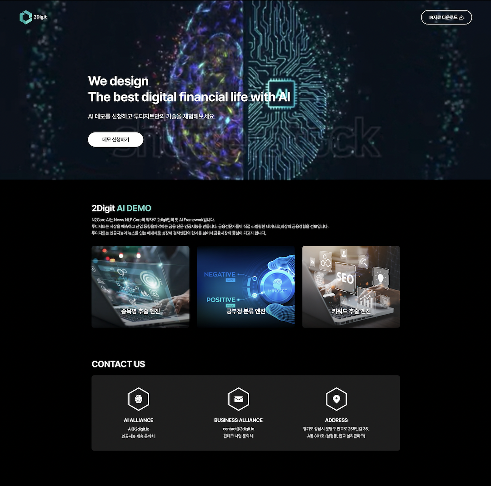
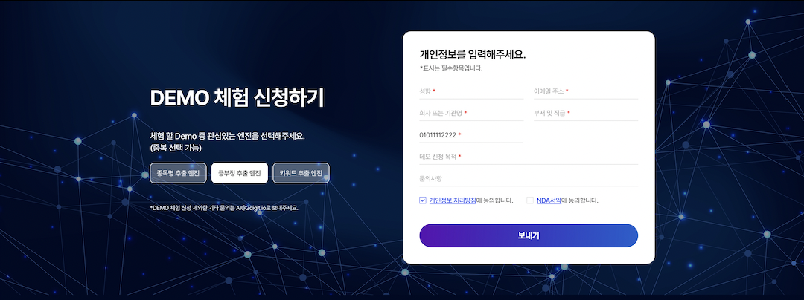

+++
author = "Sojin Shin"
title = "AI demo 랜딩 페이지 개발"
date = "2022-11-27"
description = "자사 AI 엔진 소개 및 데모 사용 신청을 위한 페이지"
tags = [
    "react",
    "javascript",
    "frontend",
]
categories = [
    "project",
]
image = "demo-thumbnail.png"
+++  

## 기술 스택
- **프론트엔드:**
  
  
  
  

  

## 이미지 모아보기
|            소개             |
|:-------------------------:|
|  |
|            신청서            |
|  |

## 설명
자사의 신규 nlp 엔진의 종류와 장점을 소개하고 데모 신청을 받기 위한 페이지를 개발하였습니다.  
[여기](http://ai.2digit.io/)를 클릭하여 프로젝트를 확인할 수 있습니다.

## 기능

• 사용자 정보 입력 폼 유효성 체크  
• PASS 본인인증 연동  
• 신청자 정보 어드민 페이지와 연동  
• 신청 현황 메일링 기능   

## 어려웠던 점 / 배운점
