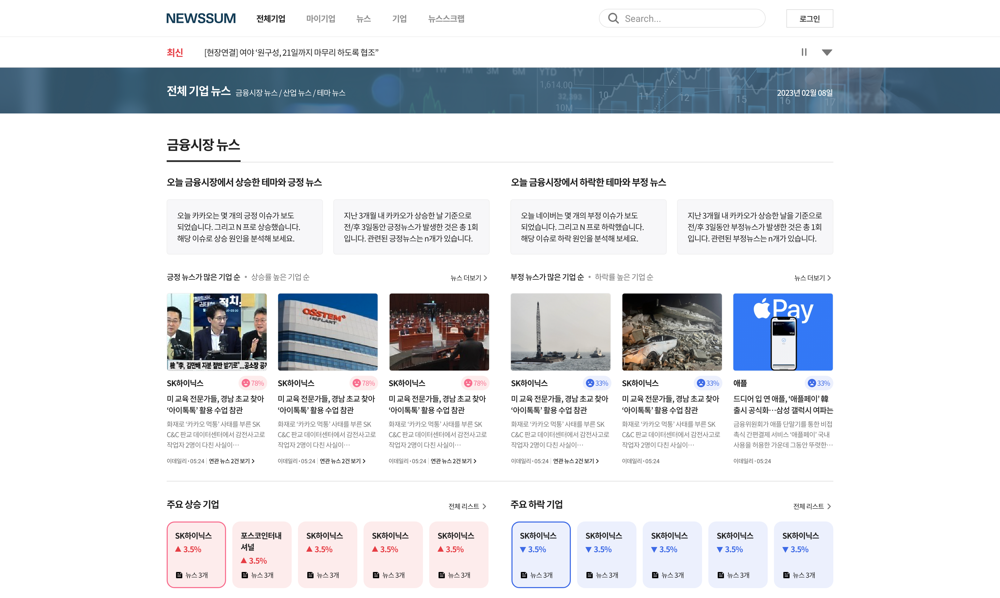
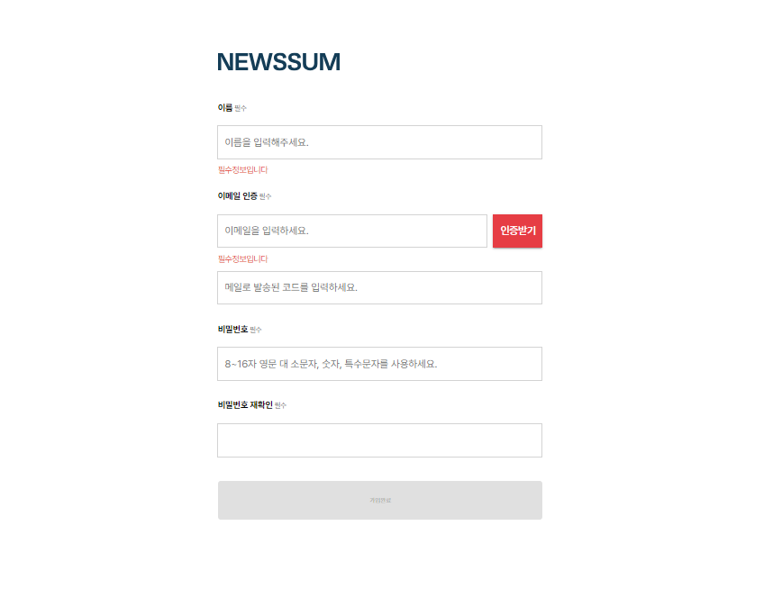
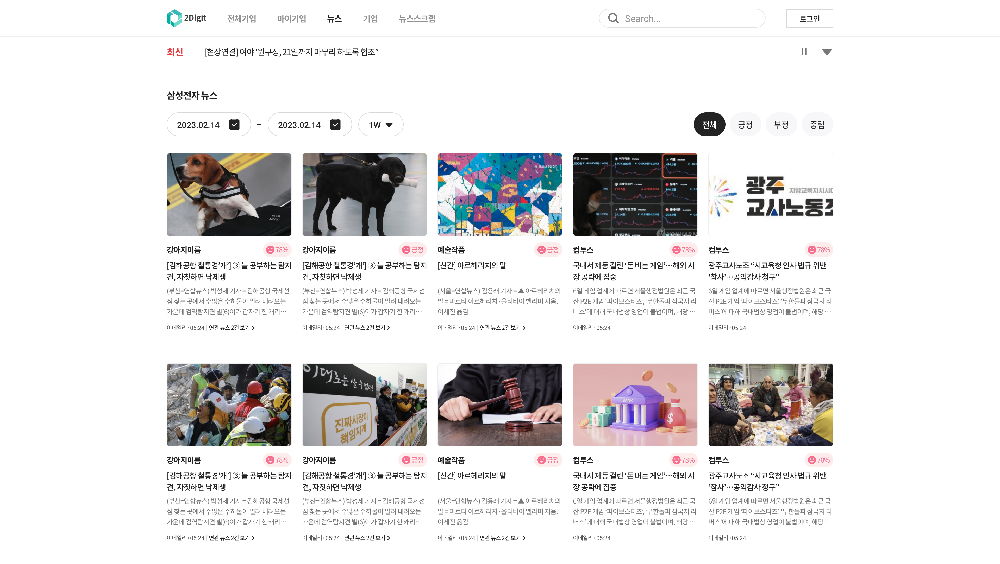
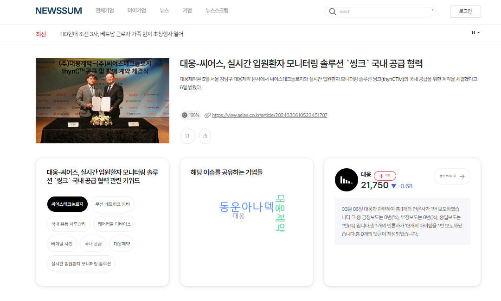
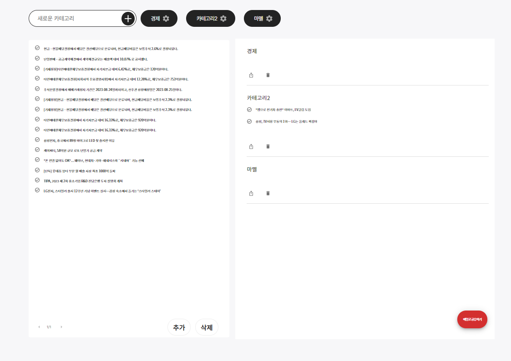
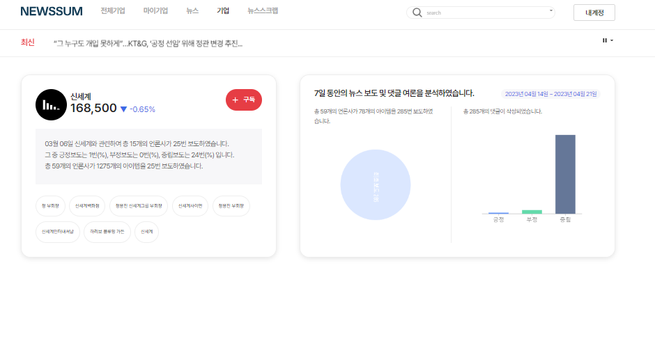

+++
author = "Sojin Shin"
title = "뉴스썸"
date = "2023-01-25"
description = "AI가 만들어주는 경제 뉴스, 뉴스썸"
categories = [
"project",
]
tags = [
"react",
"javascript",
"frontend",
]
image = "matt-le-SJSpo9hQf7s-unsplash.jpg"
+++

## 기술 스택
- **프론트엔드:**
  
  
  
  

## 이미지 모아보기
|                      메인화면(일부)                      |                  회원가입                   |
|:--------------------------------------------------:|:---------------------------------------:|
|                   |        |
|                       뉴스 목록                        |                  뉴스 상세                  |
|    |  |
|                        스크랩                         |                  기업 정보                  |
|    |    |

## 설명
"뉴스썸, 검색이 필요없는 초개인화 1인신문"이라는 슬로건으로 사용자가 관심있어하는 기업과 뉴스 정보를 추천받을 수 있는 서비스입니다. 
[여기](https://www.newssum.co.kr/)를 클릭하여 프로젝트를 확인할 수 있습니다.

## 기능

#### 회원가입
• 사용자 정보 입력 폼 유효성 체크  
• PASS 본인인증 연동  
• 신청자 정보 어드민 페이지와 연동  
• 신청 현황 메일링 기능   

#### 관심 등록