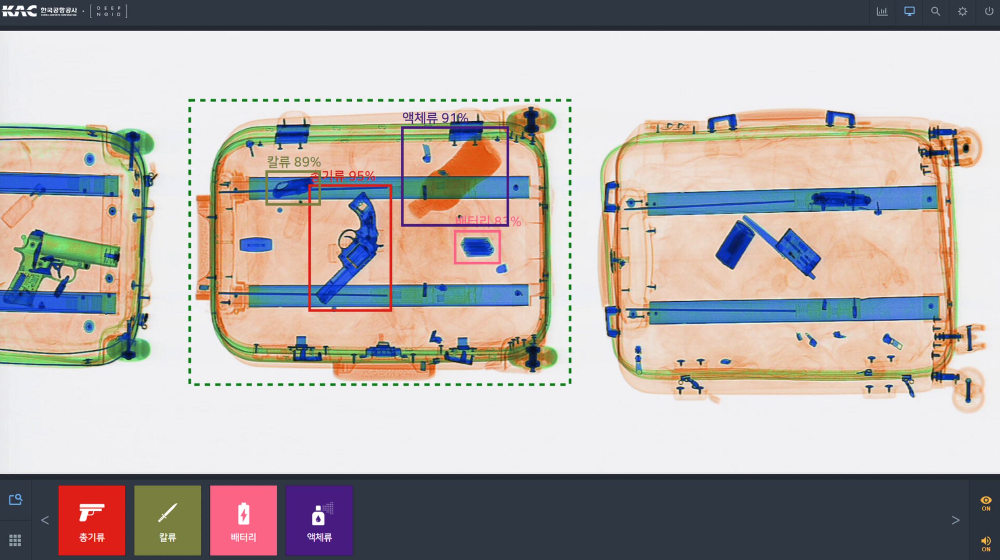
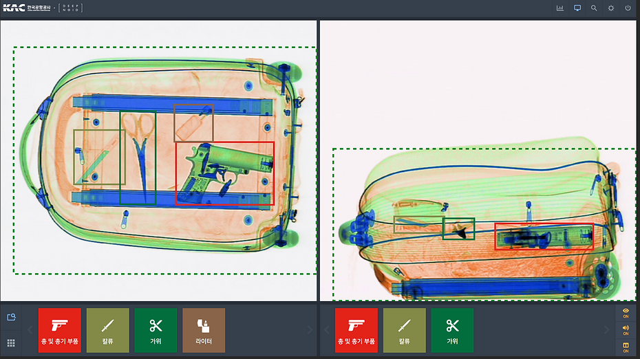
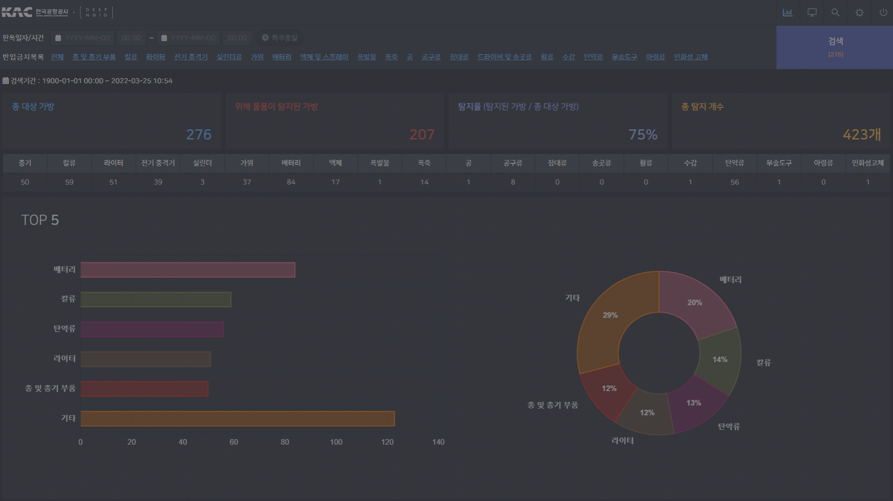

+++
author = "Sojin Shin"
title = "Plog, 개발자를 위한 블로그 서비스"
date = "2023-12-27"
description = "개발자의 성장과 커리어를 위한 블로그"
tags = [
    "react",
    "javascript",
    "frontend",
]
categories = [
    "project",
]
image = "plog-thumbnail.png"
+++

## 기술 스택
- **프론트엔드 :**
  
  
  
  

- **배포 :**

## 이미지 모아보기
|                     포스팅 홈                      |                      검색                      |
|:----------------------------------------------:|:--------------------------------------------:|
|  |      |
|                     마이 페이지                     |                  유저 블로그 메인                   |
|        |  |

## 설명
개발자를 위한, 개발자에 의한 블로그 서비스를 만들고자 했습니다. 개발자의 모든 경험/지식을 나누고 공유함으로써 더 나은 방법을 찾고, 
깃헙 이력을 시각화하여 개발자의 흔적을 한눈에 정리할 수 있도록 하는 서비스를 만들었습니다.  

[여기](https://project-555.github.io/)서 프로젝트에 대한 자세한 소개 및 project-555팀이 서비스를 개발하는 동안 고민했던 흔적을 볼 수 있습니다.

## 기능

### 다크모드

- 많은 사이트/어플리케이션에서 다크모드를 지원하고 있고, 사용자 경험 향상을 근거로 plog에도 다크모드 기능을 제공하기로 결정하였습니다.
- 토글 버튼을 이용하여 클릭 한번으로 간단하게 `라이트모드` / `다크모드`를 설정할 수 있습니다.
- local storage에 theme 정보를 기억하여 사용자가 지정한 테마를 반영구적으로 기억합니다.
- css 사용자 지정 속성을 이용하여 테마 별 색상 코드를 효율적으로 관리할 수 있습니다.

### toc

- 블로그의 기본이라고 할 수 있는 TOC 기능을 직접 구현하였습니다.
- HTML 문서 내의 제목을 수집하여 목차를 자동으로 생성하며, 이를 통해 문서의 구조를 시각적으로 파악할 수 있도록 하였습니다.
- 블로그 글이 수정되면 TOC 구조도 자동으로 갱신되도록 구현하였습니다.
- 스크롤 이동할 때 목차 강조 표시함으로써 사용자는 문서 내에서 현재 위치를 알 수 있습니다.
- 사용자는 전체 문서를 스크롤하지 않고 클릭을 통해 특정 섹션으로 이동할 수 있습니다.

### 이미지 첨부 `Drag&Drop`

- 사용자는 영역에 끌어다 놓는(드래그 앤 드랍) 동작으로 이미지를 편리하게 업로드할 수 있습니다.
- 파일을 직접 찾아 업로드 하는 것보다 직관적이며, 따라서 사용자에게 좋은 경험을 제공할 수 있다고 판단하였습니다.
- `Toast UI` 에디터를 사용하여 구현하였습니다.

### 무한 스크롤

- 블로그 홈에 작성된 모든 게시글을 로딩하지 않고 사용자가 페이지를 스크롤 할 때마다 추가적으로 불러옵니다.
- 스크롤 위치를 감시하여 블로그 게시글을 15개씩 추가 로딩합니다.
- 따라서 초기 로딩속도를 빠르게 유지 할 수 있으며, 사용자는 데이터를 기다릴 필요 없이 게시글을 조회할 수 있습니다.

## 어려웠던 점 / 배운점

#### 디자이너/기획자의 부재
Plog 프로젝트는 백엔드 개발자 2명, 프론트엔드 개발자 1명 총 3명이서 개발을 진행했습니다. 따라서 직무가 정해진 회사와 달리 한사람이 복수의 역할을 수행해야했습니다.  
저는 자연스럽게 제게 익숙하고 관심있는 디자인과 기획을 겸하게 되었습니다. (물론 이 디자인에는 UI와 UX가 함께 내포되어 있습니다.)

직무 이름부터 `프론트엔드`인 만큼, 사용자와 가장 맞닿아있는 영역입니다.
따라서 프로젝트의 구조를 작성함에 있어 가장 신경썼던 부분은 `서비스의 컨셉과 사용자 행동 flow`를 고려하는 것이었습니다.  
구현해야할 기능과 범위는 정리가 되었으나 화면으로 어떻게, 예쁘고 깔끔하게 구현할 수 있는지에 많은 시간을 쏟았습니다.

서비스를 만들기 위한 설계도를 그리는 것과, 서비스를 만들면서 작아서 눈에 띄지 않지만 그 이미지, 아이콘, 컬러를 선택하기까지 고민했던 시간들이 아무도 몰라주는 것 같아 심리적으로 어려웠습니다. 

#### 마크다운 에디터 사용
블로그형 서비스를 개발하는 것이 아닌 이상 마크다운 에디터 라이브러리를 사용할 기회가 전무합니다. 회사의 서비스나 사이드 프로젝트로 진행하는 다양한 서비스들도 대부분 데이터를 조회, 수정, 삭제하는 기능에서 멈췄습니다.  
Plog를 개발하며 마크다운 에디터를 사용해볼 기회를 얻을 수 있었습니다. 

