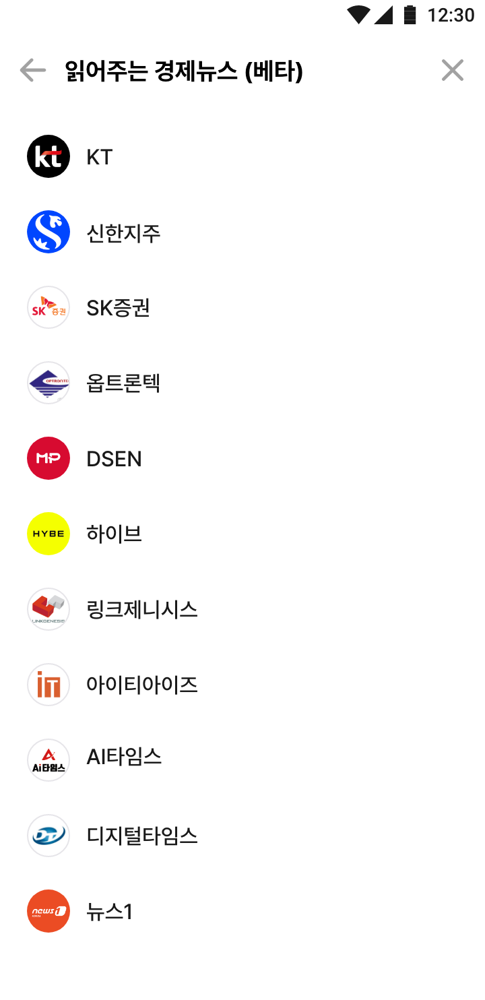
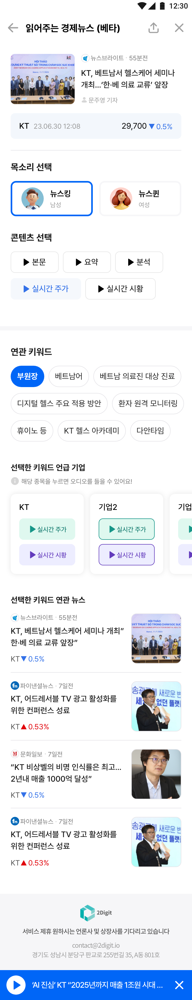
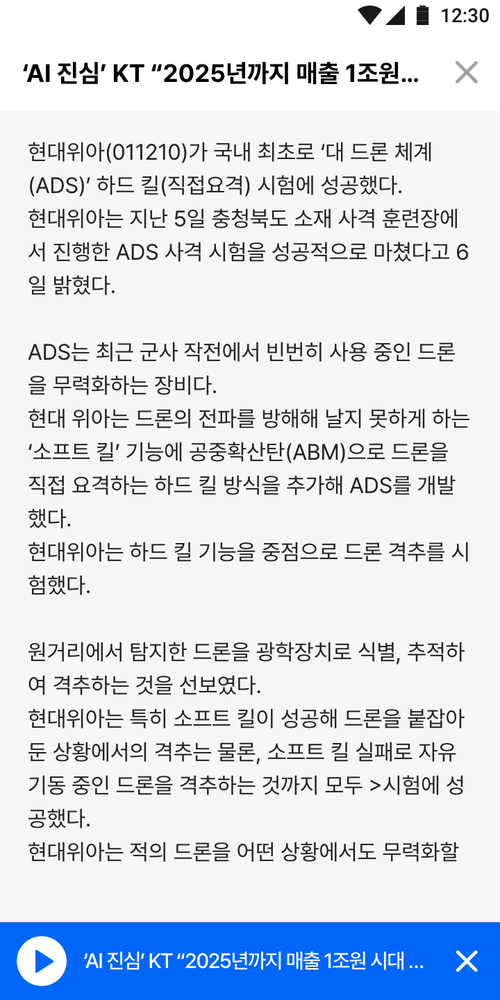

+++
author = "Sojin Shin"
title = "읽어주는 경제뉴스, 창업도약패키지 과제"
date = "2023-12-27"
description = "자사 AI 모델 QUAN과 KT 초거대 AI가 만나 실시간으로 관심 기업에 대한 최신 뉴스 분석을 언제든 어디서든 간편하게 들을 수 있는 서비스"
tags = [
"vue",
"javascript",
"frontend",
]
categories = [
"project",
]  
image = "tts-thumbnail.png"
+++

## 기술 스택
- **프론트엔드 :**
  
  
  
  

## 이미지 모아보기

|        제공 기업 목록         |                 
|:-----------------------:|
|   | 
|          뉴스 목록          |             
|   | 
|           메인            |             
|    | 
|           재생            |             
|  | 

## 설명
자사의 AI 엔진 `QUAN`과 KT의 초거대 AI가 협력하여 주식 종목과 관련된 실시간 뉴스를 읽어줍니다.  
뉴스의 본문은 물론 내용을 요약하고, 분석하여 유저에게 주가 정보와 관련된 핵심 정보만 음성으로 제공하며,
관련 키워드(테마)와 QUAN이 분석한 관련 기업들에 대한 정보를 추가적으로 제공합니다.  

[여기](http://dev-www.newssalad.com:8181/)를 클릭하여 프로젝트를 확인할 수 있습니다.  
서비스에 대한 자세한 설명은 [여기](http://2digit.io/AAEN/index.html)에서 확인 가능합니다. 

## 기능

### 뉴스 조회
• 8개 종목과 3개 언론사와 관련된 뉴스 정보 제공
• 실시간 뉴스 정보와 관련 종목을 리스트 형태로 제공  
• 뉴스에서 추출된 종목의 주가 정보 제공  
• QUAN을 통해 추출된 키워드 및 연관 종목 제공  
• 키워드에 기반한 추천 뉴스 제공  

### TTS
• 뉴스 본문, 요약, 분석 및 실시간 주가와 시황에 대한 정보 제공 (text to speech)  
• 음성 목소리 선택 가능 (남/여)  
• 오디오 대본 제공  
• 오디오 play/pause 기능 

## 어려웠던 점 / 배운점

#### 새로운 프론트 프레임워크 사용
난이도가 높은 프로젝트가 아니었고 회사의 기술 선택 자유도는 높은 편이었기 때문에 익숙하게 사용하던 React 대신 `Vue`를 사용해보기로 했습니다.  
React와 달리 Vue는 양뱡향 데이터 바인딩 방식을 이용하고 있기 때문에 React와의 차이점을 직접 체득할 수 있는 기회라고 생각하였습니다.  

**내가 느낀 Vue의 장점**
- 프레임워크이기 때문에 문법이 정해져있어 정답이 있다는 느낌이 든다. 
- 그렇기 때문에 협업 시에 리액트보다 유리할 수 있다고 판단하였다. 
- JS, CSS, HTML 을 하나의 파일에 작성하는 느낌이라 비교적 익숙한 형태이다.

**내가 느낀 Vue의 단점**
- 리액트는 자유도가 높기 떄문에 꼭 하나의 방법만 사용해야하는 것이 불편했다. 
- 양방향 데이터 바인딩이라는 개념이 낯설었다. 
- 리액트에서는 `useEffect` 훅 하나로 제어했다면 컴포넌트 생명주기 메소드 종류를 알고 있어야했다. 

전반적으로 간단하고, 협업이 필요한 프로젝트라면 Vue를 사용하는 것도 좋을 것같다는 판단이 생겼습니다. 
